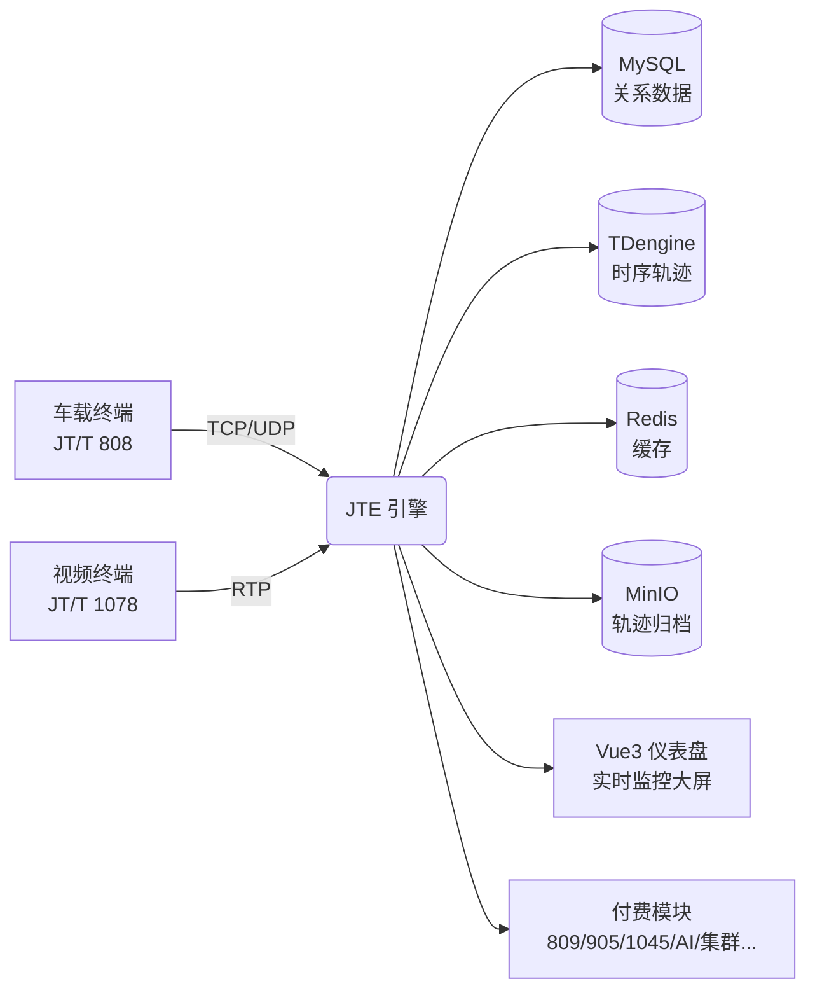

<p align="center">
  
</p>

<h1 align="center">JTE — 车联网部标协议智能引擎</h1>

<p align="center">
  <strong>一条命令跑起来 · 10 万设备接入 · 808/1078 全栈开源 · 等保 2.0 + 国密内置</strong>
</p>

<p align="center">
  <a href="https://github.com/suoten/jt-engine/blob/main/LICENSE"></a>
  <a href="https://github.com/suoten/jt-engine/releases"></a>
  
  <a href="https://github.com/suoten/jt-engine/pkgs/container/jt-engine"></a>
  <a href="https://github.com/suoten/jt-engine/stargazers"></a>
</p>

<p align="center">
  <strong>简体中文</strong> | <a href="README_EN.md">English</a>
</p>

<p align="center">
  <a href="#-60-秒跑起来无需-go-环境">60 秒跑起来</a> •
  <a href="#-为什么选择-jte">为什么选择 JTE</a> •
  <a href="#-功能一览">功能一览</a> •
  <a href="#-五种部署方式总有一款适合你">部署方式</a> •
  <a href="#-免费版-vs-付费模块">免费 vs 付费</a> •
  <a href="#-文档导航">文档</a> •
  <a href="https://www.jtengine.cn">官网</a>
</p>

---

> 🎯 **不会 Go 语言？完全没有编程基础？没关系。**
> 本 README 的「60 秒跑起来」章节专为小白设计：不编译、不配环境，复制粘贴几条命令，你的车联网平台就上线了。

---

## 🚀 60 秒跑起来（无需 Go 环境）

### 方式 ①：Docker 一条命令（最推荐）

只要你装了 Docker，复制这一行：

```bash
docker run -d --name jte \
  -p 7611:7611 -p 8080:8080 \
  ghcr.io/suoten/jt-engine:stable
```

然后：

| 你要做的事 | 地址 / 命令 |
|-----------|------------|
| 打开管理后台 | 浏览器访问 `http://localhost:8080` |
| 登录（默认账号，登录后请改密码） | `admin` / `admin123` |
| 验证服务健康 | `curl http://localhost:8080/healthz` |
| 接入车载终端 | 把终端的"平台 IP"指向 `你的服务器IP:7611`（TCP） |

✅ 就这样，一个能接入 JT/T 808 终端、看实时位置、看报警、看视频的平台已经跑起来了。

### 方式 ②：下载预编译二进制（不用装任何开发环境）

到 [Releases 页面](https://github.com/suoten/jt-engine/releases) 下载对应系统的文件：

| 系统 | 下载文件 |
|------|---------|
| Linux 服务器（x86） | `jte-linux-amd64` |
| Linux 服务器（ARM，如鲲鹏/树莓派） | `jte-linux-arm64` |
| Windows（仅体验，付费模块不可用） | `jte-windows-amd64.exe` |

Linux 服务器上 3 条命令启动：

```bash
chmod +x jte-linux-amd64
./jte-linux-amd64 serve
# 打开浏览器访问 http://服务器IP:8080
```

> 💡 二进制内嵌了 Vue3 前端和默认配置（内存存储），**单文件即可运行**，不需要数据库、不需要前端构建。

### 方式 ③：docker-compose 生产全家桶（MySQL + TDengine + Redis + MinIO + 视频）

```bash
git clone https://github.com/suoten/jt-engine.git
cd jt-engine/jte
docker compose up -d
```

一条命令拉起完整生产栈：JTE 引擎 + MySQL + TDengine 时序库 + Redis + MinIO 对象存储 + ZLMediaKit 视频服务。

### 方式 ④：宝塔面板（纯图形界面，适合零基础服务器用户）

跟着截图级教程点鼠标即可：[宝塔面板部署完整教程](BT-PANEL-DEPLOY.md)

### 方式 ⑤：源码编译（开发者）

```bash
cd jte && make build-binary && ./bin/jte serve --config configs/jte.yaml
```

---

## 💡 为什么选择 JTE？

| 你的痛点 | JTE 的答案 |
|---------|-----------|
| 部标协议复杂，自研要半年 | 开箱即用，808/1078 开源，全协议模块按需解锁 |
| 设备一多就卡死 | 单机 10 万连接实测，TDengine 千万点/秒写入 |
| 等保 2.0 测评过不了 | 三权分立 + 国密 SM2/SM3/SM4 + 链式防篡改审计日志，开箱合规 |
| 报警太多看不过来 | AI 报警过滤 + 自然语言查询："查一下今天超速的车辆"（付费模块） |
| 国产化替代要求 | 达梦/金仓/高斯数据库 + 麒麟/统信 OS + 国密 SSL，全栈信创 |
| 怕被 SaaS 绑架 | 私有化部署，数据全在你自己机房 |

---

## ✨ 功能一览



- 🚛 **JT/T 808-2019 全量**：注册/鉴权/心跳/位置/报警/指令下发/区域路线/多媒体/分包重组/SeqNum 去重
- 🎥 **JT/T 1078-2022 音视频**：实时视频/历史回放/远程下载/云台控制/RTP over TCP+UDP/双码流切换/SRTP 加密
- 🖥️ **开箱即用的管理后台**：实时监控大屏、地图轨迹、设备/车辆/驾驶员管理、报警中心、指令下发、报表统计（Vue3 + Element Plus，中英文切换）
- 🔐 **企业级安全**：JWT 双 Token 轮换、RBAC 权限、数据脱敏、SQL 注入/XSS/CSRF 防护、登录防爆破、设备指纹
- 📊 **可观测性**：Prometheus 指标、Grafana 面板、OpenTelemetry 链路追踪、健康检查端点
- 🧩 **插件化架构**：付费模块 `.so` 热插拔，签名防篡改，授权码离线激活（支持政务内网）
- 📦 **归档与回放**：轨迹按日自动归档到 MinIO，实时+归档联合查询，省钱省库

---

## 🆓 免费版 vs 付费模块

### 开源版（本仓库，AGPL-3.0，永久免费）

| 功能 | 说明 |
|------|------|
| JT/T 808-2019 | 终端全生命周期接入 |
| JT/T 1078-2022 | 音视频全链路 |
| 核心引擎 | 网关 / API / 会话管理 / 模块加载框架 / 配置热加载 |
| 存储 | SQLite / MySQL / TDengine / Redis / MinIO + 离线归档 |
| 安全 | 国密 SM2/SM3/SM4 + 等保 2.0 合规套件 |
| 前端 | Vue3 完整仪表盘（中英文） |
| License 框架 | 授权码激活/绑定/试用框架（开源可见，放心审计） |

### 付费模块（[官网](https://www.jtengine.cn) 获取，30 天免费试用）

| 模块 | 价格 | 说明 |
|------|------|------|
| module-protocol-809 | ¥3,800/年 | JT/T 809-2019 平台级联（主从链路/指数退避重连/视频协商） |
| module-protocol-905 | ¥2,800/年 | JT/T 905-2014 出租车/网约车（电召调度/计价器/CAN） |
| module-protocol-1045 | ¥2,800/年 | JT/T 1045 主动安全（DSM/ADAS/盲区/胎压） |
| module-protocol-1253 | ¥2,800/年 | JT/T 1253-2019 JSON 版 809 |
| module-protocol-32960 | ¥2,800/年 | GB/T 32960 新能源汽车（电池单体/充电/故障码） |
| module-legacy | ¥3,800/年 + ¥5,000/省 | 旧版协议 + 地方标准（苏/粤/浙/川/陕/沪/京/鲁） |
| module-ai | ¥3,800/年 | AI 智能分析（报警过滤/风险评分/ONNX 推理） |
| module-ai-nlp | ¥2,800/年 | AI 自然语言（RAG/NL2SQL/AI 报表/协议调试） |
| module-cluster | ¥6,800/年 | 集群部署（蓝绿/滚动升级/多节点） |
| module-crypto | ¥3,800/年 | 国密加密增强（SM4-GCM/国密 SSL/TLCP） |
| module-security-audit | ¥2,800/年 | 等保 2.0 合规审计报告 |
| module-monitor | ¥2,800/年 | 监控告警（短信/邮件/Webhook/钉钉/企微） |
| module-storage | ¥4,800~88,800/年 | 四层存储增强（TDengine ws/Stmt2/TMQ） |
| module-fleet | ¥4,800/年 | 车队运营管理 |
| module-tts | ¥1,800/年 | TTS 语音播报 |
| module-loadtest | ¥1,800/年 | 压测工具（10 万连接） |
| module-adapter | ¥2,800/年 | 终端厂商适配 |

> 💎 **30 秒购买体验**：管理后台里灰显模块 → 点「购买解锁」→ 扫码支付 → 自动发码、自动下载、自动激活，全程不离开后台。离线环境也支持官网买码、手动粘贴激活。

---

## 🛠️ 五种部署方式，总有一款适合你

| 方式 | 适合人群 | 难度 | 教程 |
|------|---------|------|------|
| Docker 单容器 | 快速体验 | ⭐ | 本文上方「60 秒跑起来」 |
| Docker Compose | 生产部署（推荐） | ⭐⭐ | [DEPLOYMENT.md](DEPLOYMENT.md) |
| 预编译二进制 | 无 Docker 的服务器 | ⭐ | [Releases](https://github.com/suoten/jt-engine/releases) |
| 宝塔面板 | 零基础、喜欢图形界面 | ⭐⭐ | [BT-PANEL-DEPLOY.md](BT-PANEL-DEPLOY.md)（截图级教程） |
| 源码编译 / K8s | 开发者、大规模集群 | ⭐⭐⭐ | [DEPLOYMENT.md](DEPLOYMENT.md) |

> ✅ 上线前请对照 [生产配置核对清单](CONFIG_CHECKLIST.md) 逐项打勾。
> 🔑 激活授权码、安装付费模块请见 [部署激活指南](DEPLOY-ACTIVATION-GUIDE.md)。

---

## 📚 文档导航

| 文档 | 内容 |
|------|------|
| [DEPLOYMENT.md](DEPLOYMENT.md) | 生产部署完整指南（Docker/K8s/信创） |
| [BT-PANEL-DEPLOY.md](BT-PANEL-DEPLOY.md) | 宝塔面板截图级部署教程（小白友好） |
| [DEPLOY-ACTIVATION-GUIDE.md](DEPLOY-ACTIVATION-GUIDE.md) | 授权激活 + 付费模块安装指南 |
| [CONFIG_CHECKLIST.md](CONFIG_CHECKLIST.md) | 上线前配置核对清单 |
| [CONTRIBUTING.md](CONTRIBUTING.md) | 贡献指南 |
| [jte/docs/](jte/docs/) | 协议兼容性、性能报告、运维手册 |
| [官网文档中心](https://www.jtengine.cn/docs) | 在线文档（含 API 文档、模块手册） |

---

## 🏗️ 项目结构

```
jt-engine/                     # 开源仓库根
├── jte/                       # 核心引擎（Go monorepo）
│   ├── cmd/                   # 命令行入口
│   ├── internal/              # API / 网关 / 安全 / 审计 / 模块加载
│   ├── pkg/                   # JT808 / JT1078 协议库、存储抽象
│   ├── web/                   # Vue3 前端（go:embed 内嵌进二进制）
│   ├── configs/               # jte.yaml 配置
│   └── deploy/                # Docker / K8s / 监控部署文件
├── scripts/                   # 验收脚本
├── README.md                  # ← 你在这里（中文版）
├── README_EN.md               # English version
├── DEPLOYMENT.md / BT-PANEL-DEPLOY.md / CONFIG_CHECKLIST.md
└── LICENSE                    # AGPL-3.0
```

## 🧰 技术栈

Go 1.22+ / Gin / Zap / Viper · Vue 3 / Vite / Element Plus / Pinia · TDengine 3.8+（Stmt2）· MySQL / 达梦 / 金仓 / 高斯 · Redis · MinIO · ZLMediaKit · 国密 gmssl

---

## 📜 开源协议

**AGPL-3.0** — 可自由使用、修改、分发；通过网络提供服务也必须开源。企业商用如需闭源，请购买[商业授权](https://www.jtengine.cn/pricing)。

> ⚠️ AGPL 第 13 条网络条款：对外提供基于本软件的服务需开放完整源码，商业授权可免除该义务。

## 🤝 联系与社区

- 🐛 问题反馈：[GitHub Issues](https://github.com/suoten/jt-engine/issues)
- 🇨🇳 国内镜像：[Gitee](https://gitee.com/suoten/jt-engine)
- 🌐 官网：https://www.jtengine.cn （付费模块 · 技术支持 · 商业授权）
- 🛒 模块商店：https://www.jtengine.cn/store

---

<p align="center">
  如果 JTE 帮到了你，请点一颗 ⭐ Star，这是我们持续开源的最大动力！
</p>
