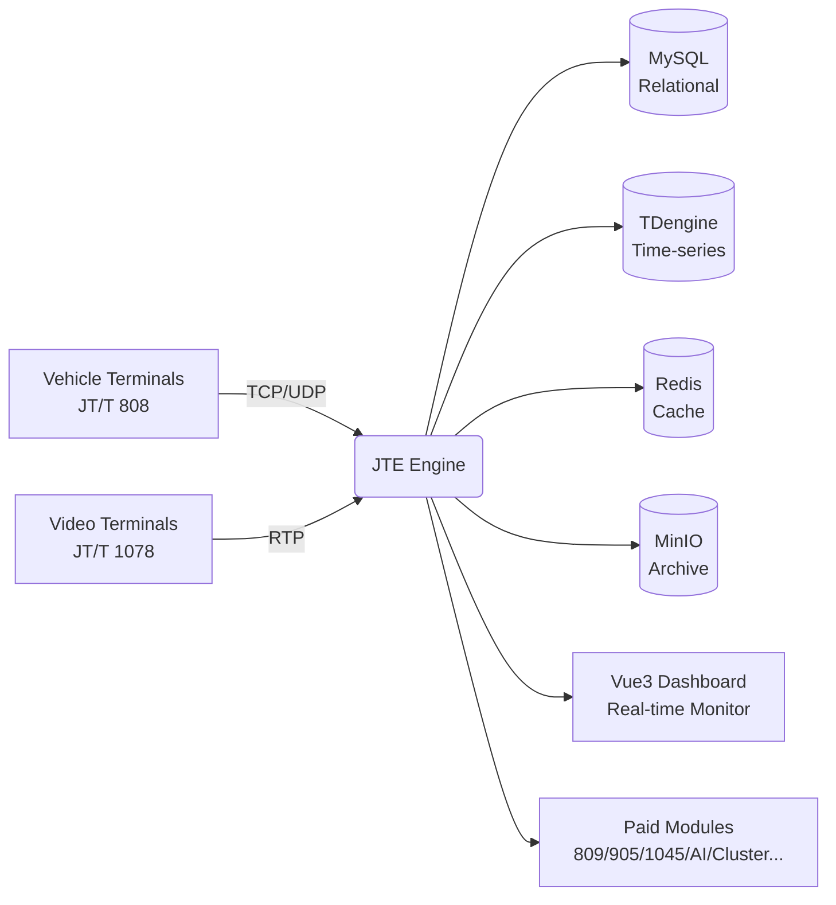

<p align="center">
  
</p>

<h1 align="center">JTE — Intelligent Engine for China JT/T Telematics Protocols</h1>

<p align="center">
  <strong>One command to run · 100K device connections · JT/T 808 & 1078 fully open-source · MLPS 2.0 & SM crypto built-in</strong>
</p>

<p align="center">
  <a href="https://github.com/suoten/jt-engine/blob/main/LICENSE"></a>
  <a href="https://github.com/suoten/jt-engine/releases"></a>
  
  <a href="https://github.com/suoten/jt-engine/pkgs/container/jt-engine"></a>
  <a href="https://github.com/suoten/jt-engine/stargazers"></a>
</p>

<p align="center">
  <a href="README.md">简体中文</a> | <strong>English</strong>
</p>

<p align="center">
  <a href="#-up--running-in-60-seconds-no-go-required">Quick Start</a> •
  <a href="#-why-jte">Why JTE</a> •
  <a href="#-features">Features</a> •
  <a href="#-deployment-options">Deployment</a> •
  <a href="#-open-source-vs-paid-modules">Free vs Paid</a> •
  <a href="https://www.jtengine.cn">Website</a>
</p>

---

> 🎯 **Don't know Go? Never written code? No problem.**
> The quick-start below is designed for absolute beginners: no compilation, no dev environment — copy a few commands and your telematics platform is live.

---

## 🚀 Up & Running in 60 Seconds (No Go Required)

### Option 1: One Docker command (recommended)

```bash
docker run -d --name jte \
  -p 7611:7611 -p 8080:8080 \
  ghcr.io/suoten/jt-engine:stable
```

Then:

| What you want | Where / Command |
|---------------|-----------------|
| Open the dashboard | Visit `http://localhost:8080` in your browser |
| Log in (change the password afterwards) | `admin` / `admin123` |
| Health check | `curl http://localhost:8080/healthz` |
| Connect terminals | Point your JT/T 808 devices to `your-server-ip:7611` (TCP) |

✅ That's it — a platform that ingests JT/T 808 terminals, shows live locations, alarms, and video is now running.

### Option 2: Prebuilt binaries (zero dev environment)

Grab your platform's file from the [Releases page](https://github.com/suoten/jt-engine/releases):

| Platform | File |
|----------|------|
| Linux x86_64 server | `jte-linux-amd64` |
| Linux ARM64 (Kunpeng, Raspberry Pi) | `jte-linux-arm64` |
| Windows (trial only; paid modules unavailable) | `jte-windows-amd64.exe` |

Three commands on a Linux server:

```bash
chmod +x jte-linux-amd64
./jte-linux-amd64 serve
# Open http://server-ip:8080 in your browser
```

> 💡 The binary embeds the Vue3 frontend and a default in-memory config — a **single file runs everything**, no database or frontend build needed.

### Option 3: docker-compose production stack

```bash
git clone https://github.com/suoten/jt-engine.git
cd jt-engine/jte
docker compose up -d
```

Brings up the full production stack: JTE engine + MySQL + TDengine time-series DB + Redis + MinIO object storage + ZLMediaKit video server.

### Option 4: BT Panel (GUI-only, for beginners)

Follow the screenshot-level tutorial: [BT-PANEL-DEPLOY.md](BT-PANEL-DEPLOY.md) (Chinese).

### Option 5: Build from source (developers)

```bash
cd jte && make build-binary && ./bin/jte serve --config configs/jte.yaml
```

---

## 💡 Why JTE?

| Your pain point | JTE's answer |
|-----------------|--------------|
| JT/T protocols are complex; months of dev time | Works out of the box — 808/1078 open-source, all other protocols as unlockable modules |
| Performance collapses at scale | 100K concurrent connections per node verified; TDengine ingests tens of millions of points/sec |
| MLPS 2.0 (China's security baseline) compliance | Three-role separation + SM2/SM3/SM4 crypto + tamper-proof chained audit logs, compliant out of the box |
| Alarm fatigue | AI alarm filtering + natural-language queries: "show today's speeding vehicles" (paid module) |
| Vendor lock-in | Self-hosted — all data stays in your own facility |

---

## ✨ Features



- 🚛 **Full JT/T 808-2019**: registration/auth/heartbeat/location/alarms/commands/geofence/multimedia/packet reassembly/SeqNum dedup
- 🎥 **JT/T 1078-2022 video**: live streaming/playback/download/PTZ/RTP over TCP+UDP/dual-stream switching/SRTP
- 🖥️ **Ready-to-use dashboard**: real-time monitoring, map tracks, device/vehicle/driver management, alarm center, command console, reports (Vue3 + Element Plus, Chinese/English UI)
- 🔐 **Enterprise security**: JWT dual-token rotation, RBAC, data masking, SQLi/XSS/CSRF protection, login guard, device fingerprint
- 📊 **Observability**: Prometheus metrics, Grafana dashboards, OpenTelemetry tracing, health endpoints
- 🧩 **Plugin architecture**: signed `.so` modules with hot-plug, offline license activation (works in air-gapped networks)
- 📦 **Archiving**: daily track archives to MinIO with unified real-time + archived queries

---

## 🆓 Open Source vs Paid Modules

### Open-source (this repo, AGPL-3.0, forever free)

JT/T 808-2019 · JT/T 1078-2022 · Core engine (gateway/API/session/module loader/hot-reload) · SQLite/MySQL/TDengine/Redis/MinIO storage + archiving · SM2/SM3/SM4 + MLPS 2.0 compliance suite · Full Vue3 dashboard · Open license framework

### Paid modules (from the [official website](https://www.jtengine.cn), 30-day free trial)

| Module | What it adds |
|--------|--------------|
| module-protocol-809 | JT/T 809-2019 platform cascading (dual-link, exponential-backoff reconnect, video negotiation) |
| module-protocol-905 | JT/T 905-2014 taxi/ride-hailing (dispatch, meter, CAN bus) |
| module-protocol-1045 | JT/T 1045 active safety (DSM/ADAS/blind-spot/TPMS) |
| module-protocol-1253 | JT/T 1253-2019 (JSON-flavored 809) |
| module-protocol-32960 | GB/T 32960 NEV (battery cells, charging, fault codes) |
| module-legacy | Legacy protocol versions + provincial standards (8 provinces) |
| module-ai | AI analysis (alarm filtering, risk scoring, ONNX inference) |
| module-ai-nlp | Natural language (RAG, NL2SQL, AI reports, protocol debugging) |
| module-cluster | Clustering (blue-green/rolling upgrades, multi-node) |
| module-crypto | Enhanced SM crypto (SM4-GCM, GM SSL/TLCP) |
| module-security-audit | MLPS 2.0 compliance audit reports |
| module-monitor | Alerting (SMS/email/webhook/DingTalk/WeCom) |
| module-storage | 4-tier storage enhancement (TDengine ws/Stmt2/TMQ) |
| module-fleet | Fleet operations management |
| module-tts | TTS voice broadcast |
| module-loadtest | Load-testing toolkit (100K connections) |
| module-adapter | Terminal vendor adaptations |

> 💎 **30-second purchase flow**: click a grayed-out module in the dashboard → scan to pay → license auto-issued, module auto-downloaded and activated — never leave the console. Offline/air-gapped: buy on the website, paste the code manually.

---

## 🛠️ Deployment Options

| Method | Best for | Difficulty | Guide |
|--------|----------|-----------|-------|
| Single Docker container | Quick evaluation | ⭐ | "60 Seconds" above |
| Docker Compose | Production (recommended) | ⭐⭐ | [DEPLOYMENT.md](DEPLOYMENT.md) |
| Prebuilt binary | Servers without Docker | ⭐ | [Releases](https://github.com/suoten/jt-engine/releases) |
| BT Panel (GUI) | Beginners | ⭐⭐ | [BT-PANEL-DEPLOY.md](BT-PANEL-DEPLOY.md) (Chinese) |
| Source / Kubernetes | Developers, large clusters | ⭐⭐⭐ | [DEPLOYMENT.md](DEPLOYMENT.md) |

> ✅ Before going live, work through the [production config checklist](CONFIG_CHECKLIST.md).

---

## 📚 Documentation

| Doc | Contents |
|-----|----------|
| [DEPLOYMENT.md](DEPLOYMENT.md) | Full production deployment guide (Docker/K8s/domestic-OS) |
| [BT-PANEL-DEPLOY.md](BT-PANEL-DEPLOY.md) | BT Panel tutorial with step-by-step screenshots (Chinese) |
| [DEPLOY-ACTIVATION-GUIDE.md](DEPLOY-ACTIVATION-GUIDE.md) | License activation + paid module installation |
| [CONFIG_CHECKLIST.md](CONFIG_CHECKLIST.md) | Pre-launch config checklist |
| [CONTRIBUTING.md](CONTRIBUTING.md) | Contributing guide |
| [jte/docs/](jte/docs/) | Protocol compatibility, performance reports, ops runbooks |

## 🏗️ Repository Layout

```
jt-engine/                     # repo root
├── jte/                       # core engine (Go monorepo)
│   ├── cmd/                   # CLI entrypoints
│   ├── internal/              # API / gateway / security / audit / module loader
│   ├── pkg/                   # JT808 / JT1078 protocol libs, storage abstractions
│   ├── web/                   # Vue3 frontend (embedded via go:embed)
│   ├── configs/               # jte.yaml
│   └── deploy/                # Docker / K8s / monitoring manifests
├── scripts/                   # acceptance scripts
├── README.md                  # 中文版
├── README_EN.md               # ← you are here
└── LICENSE                    # AGPL-3.0
```

## 🧰 Tech Stack

Go 1.22+ / Gin / Zap / Viper · Vue 3 / Vite / Element Plus / Pinia · TDengine 3.8+ (Stmt2) · MySQL / Dameng / Kingbase / GaussDB · Redis · MinIO · ZLMediaKit · GM SSL

---

## 📜 License

**AGPL-3.0** — free to use, modify and distribute; offering it as a network service also requires open-sourcing. Commercial licenses are available if you need to keep your code closed.

## 🤝 Community & Contact

- 🐛 Issues: [GitHub Issues](https://github.com/suoten/jt-engine/issues)
- 🇨🇳 China mirror: [Gitee](https://gitee.com/suoten/jt-engine)
- 🌐 Website: https://www.jtengine.cn (paid modules · support · commercial licensing)

---

<p align="center">
  If JTE helps you, please give us a ⭐ — it keeps the open-source engine running!
</p>
